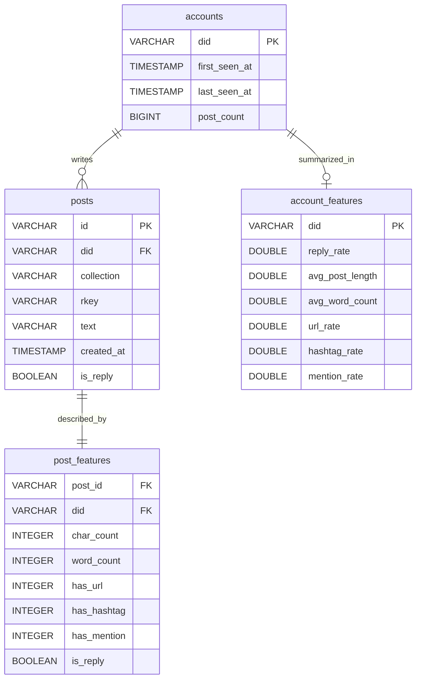

# DS 4320 Project 1: Detecting Likely Automated Bluesky Accounts 

#### Executive Summary
This project analyzes real-time data from the Bluesky social media platform to identify accounts that exhibit bot-like behavior. Using data collected from the Bluesky Firehose API, the repository includes a full pipeline for ingesting raw post data, engineering behavioral features, and aggregating activity at the account level. Key signals such as posting frequency, reply behavior, and content patterns (e.g., URL usage) are used to characterize accounts. The project prioritizes identifying high-confidence bot-like profiles using interpretable features and a modular data structure, while acknowledging uncertainty due to limited observation windows and the absence of ground truth labels.

Ivey Mistele\
Computing ID: zyh4up\
DOI: \
Press Release: [Link](https://github.com/iveymistele/Bluesky-Bot-Detection/blob/main/press_release.md)\
Data: [Link](https://myuva-my.sharepoint.com/:f:/g/personal/zyh4up_virginia_edu/IgDohLMCAK-RRKmYPl1QViVRAel_N3mQHVozNomswaI5pbc?e=pCEpvf)\
Pipeline: [Link](https://github.com/iveymistele/Bluesky-Bot-Detection/blob/main/pipeline/pipeline.ipynb)\
MIT License: [Link](https://github.com/iveymistele/Bluesky-Bot-Detection/blob/main/LICENSE)

## Problem Definition

#### General Problem:  Identifying automated social media accounts (bots).

#### Refined Problem Statement:** Developing a model to identify accounts on Bluesky that are likely automated (bots) using engagement patterns, posting behavior, and text features. 

#### Rationale: 

I chose to focus on Bluesky because it provides publicly accessible, real-time data through the firehose API, which made it feasible to collect a large and relevant dataset for analysis. Compared to other platforms with more restrictive APIs, this allowed me to work directly with live social media activity rather than relying on pre-collected datasets. I refined the problem to focus on bot detection because automated accounts often follow similarly distinct behavioral patterns. I used features that are available in the data, like posting frequency, reply behavior, and text features like hashtags and links. These features represent account interaction with the platform, which potentially differs between bots and human accounts. By focusing on existing patterns in behavior and content, the model aims to identify accounts that act in ways that are more consistent with automated activity, even without explicitly labeled training data.

#### Project Motivation: 
 
Bots make up a significant portion of internet traffic, and their presence on social media platforms can impact the quality and reliability of user interactions. Identifying these automated accounts is important for detecting spam, promotional content, and coordinated activity that may distort engagement metrics. Additionally, tools for identifying bot-like behavior can help platforms and businesses better understand user activity and take steps to manage or reduce the influence of automated accounts. This project aims to explore how behavioral and content-based signals can be used to detect accounts that exhibit bot-like patterns.

#### Press Release: New Tool Uses Real-Time Data to Identify Bot-Like Activity on Social Media Platforms

[Link to Press Release](https://github.com/iveymistele/Bluesky-Bot-Detection/blob/main/press_release.md)

## Domain Exposition 

#### Terminology

| Term | Explanation |
|---|---|
|Account (DID)| A unique Bluesky user identifier used to group posts by user. |
|Post| A single message created by a user in the Bluesky platform. |
|Bot-like Account | An account exhibiting automated/non-human behavioral patterns. |
|Human-like Account | An account exhibiting natural human behavior (conversational). |
|Reply Rate | Proportion of Bluesky posts that are replies; proxy for conversational engagement. |
|URL Rate | Proportion of posts containing links; often higher in promotional or automated accounts. |
|Hashtag Rate | Frequency of hashtag usage in posts. |
|Mention Rate | Frequency of tagging other users in posts. |
|Average Post Length| Average character length of posts for an account. |
|Total Posts| Number of posts observed for an account during the collection window. |
|Label | Account classification (1 = likely bot, 0 = likely human, None = inconclusive). |
|Cluster | Group assignment from unsupervised KMeans clustering. | 

#### Key Metrics (KPIs)

| Metric | Purpose |
|---|---|
|Accuracy| Overall correctness of the classifier on unseen data. |
|Precision| How many predicted bots are actually bot-like. |
|Recall| How many bot-like accounts are successfully identified. | 
|F1 Score| Balance between precision and recall. | 
|Feature Coefficients| Indicate which behaviors are most associated with bot-like accounts. |

#### Project Domain

This project falls within the broader domain of bot detection on social media. The goal in this space is to identify accounts that are likely automated rather than human, usually based on patterns in behavior, activity, and interaction. This is important because bots can influence conversations, spread spam or misinformation, and distort engagement metrics. My project looks at this problem specifically in the context of Bluesky, using behavioral data to approximate which accounts might be bot-like.

#### Background Readings: [Link](https://myuva-my.sharepoint.com/:f:/g/personal/zyh4up_virginia_edu/IgDtRN1JEgtmSqAeFWx2VAQ-AYCNCmTYpc_DqgbPrcGhEyI?e=NX7sbn)

#### Reading Summary

| Title of Article | Description | Link |
|---|---|---|
|Social Media Bots Infographic Set|A set of informative infographics defining "bot" account behavior and warning signs made by the US Cybersecurity and Infrastructure Security Agency. | https://myuva-my.sharepoint.com/:b:/g/personal/zyh4up_virginia_edu/IQDkTME9CtjuQ6kqDxbh46-RAXILmNvZvw-YGKZLFG8Qehg?e=TC4Rfc |
| What is a social media bot? Social media bot definition | An article by Cloudfare defining social media bots and their objectives. | https://myuva-my.sharepoint.com/:u:/r/personal/zyh4up_virginia_edu/Documents/DBD%20Project%201/Background%20Reading/Social%20Media%20Bot%20Definition.url?csf=1&web=1&e=W3kdtc |
| Social media platforms aren't doing enough to stop harmful AI bots, research finds | An article describing research from the University of Notre Dame on the AI bot policies of several major social media platforms. | https://myuva-my.sharepoint.com/:u:/r/personal/zyh4up_virginia_edu/Documents/DBD%20Project%201/Background%20Reading/Social%20Media%20Bot%20Definition.url?csf=1&web=1&e=W3kdtc |
| A global comparison of social media bot and human characteristics | A scientific article published analyzing three challenges of studying bot detection: systematic detection, differentiation of harmful/beneficial behavior, and restriction of harmful bots. | https://myuva-my.sharepoint.com/:u:/r/personal/zyh4up_virginia_edu/Documents/DBD%20Project%201/Background%20Reading/A%20global%20comparison%20of%20social%20media%20bot%20and%20human%20characteristics.url?csf=1&web=1&e=rOREwc |
| Understanding the Influence of Social Media Bots | An article from ICUC explaining the importance of bot detection in social media. | https://myuva-my.sharepoint.com/:u:/r/personal/zyh4up_virginia_edu/Documents/DBD%20Project%201/Background%20Reading/Understanding%20the%20influence%20of%20social%20media%20bot%20accounts.url?csf=1&web=1&e=z4uQyj |

## Data Creation

#### Provenance

I collected the raw data using the publicly available Bluesky Firehose API. I wrote my own ingestion [script](https://github.com/iveymistele/Bluesky-Bot-Detection/blob/main/jetstream.py) which connects to the API and ingests and parses raw JSON into two tables, `accounts` and `posts`, saved in both a DuckDB database for initial exploration and as parquet files. These two tables represent the core entities in the dataset, where `accounts` contains unique users and `posts` contains information about individual pieces of content. I then wrote two [SQL transformations](https://github.com/iveymistele/Bluesky-Bot-Detection/blob/main/pipeline/1_create_features.sql) to create two new tables, `account_features` and `post_features`, as new derived tables. The `post_features` table contains per-post attributes such as text length and presence of URLs/hashtags, and `account_features` contains information about aggregated behavior at the account level, such as reply rate. These tables are transformatd views of the underlying data. I used a python [script](https://github.com/iveymistele/Bluesky-Bot-Detection/blob/main/pipeline/write_parquet.py) to write these two new tables from the DuckDB database to parquet format. 

#### Code

|File Name|Description|Link|
|---|---|---|
|jetstream.py|Ingestion script for Bluesky Firehose API. Stores events in local DuckDB database file and as local parquet files.|https://github.com/iveymistele/Bluesky-Bot-Detection/blob/main/jetstream.py|
|requirements.txt|Contains required python packages to run python scripts for data creation.|https://github.com/iveymistele/Bluesky-Bot-Detection/blob/main/requirements.txt|
|write_parquet.py|Converts DuckDB database contents to parquet files.|https://github.com/iveymistele/Bluesky-Bot-Detection/blob/main/pipeline/write_parquet.py|
|1_create_features.sql|SQL commands to create two new tables, account_features and post_features from root data.| https://github.com/iveymistele/Bluesky-Bot-Detection/blob/main/pipeline/1_create_features.sql |

#### Bias Identification

Bias may be introduced through both data collection and labeling. The data comes from a short Firehose collection window, so it may not fully represent all types of users or behaviors on Bluesky.

A larger source of bias comes from the labeling process. Since there is no ground truth, I used heuristic thresholds (e.g., high activity and URL usage) to define bot-like accounts. This likely captures only the most obvious cases and may misclassify real users with similar behavior, such as organizations or highly active accounts.

#### Bias Mitigation

To reduce bias, I only labeled accounts with clearly extreme behavior and left others unlabeled to avoid introducing noise. I also removed features used in labeling from the model to prevent data leakage and force the model to learn from independent signals.

I also evaluated performance using precision, recall, and F1 score rather than accuracy alone, and manually inspected example posts from predicted bot-like accounts to check that results were reasonable.

#### Rationale

Several parts of the data creation process required judgment calls around how to structure raw Bluesky data into usable features for analysis and modeling. 

The dataset is organized into four tables: `posts`, `accounts`, `post_features`, and `account_features`. This separates raw data from derived features and to support a modular, reproducible pipeline. This structure allows each stage of the data creation process (ingestion, feature engineering, and aggregation) to be clearly defined and independently adjustable.

The `posts` table stores the raw data collected from the Bluesky Firehose, including post text, timestamps, and metadata such as whether a post is a reply. This serves as the foundational dataset and preserves the original information without transformation. The accounts table captures ingestion-level summaries for each user, including when the account was first and last observed and the total number of posts seen during the collection window. These two tables represent the raw layer of the pipeline.

The `post_features` table builds directly on posts by adding engineered features at the post level, such as character count, word count, and indicators for URLs, hashtags, and mentions. This intermediate layer isolates feature engineering logic from raw data storage, making it easier to iterate on feature definitions without modifying the underlying dataset.

The `account_features` table aggregates post-level features to the account level, producing behavioral summaries such as reply rate, average post length, and rates of URL, hashtag, and mention usage. This aggregation step is designed to capture consistent patterns in user behavior, which are more informative for identifying bot-like activity than individual posts.

Although both `accounts` and `account_features` are keyed by `did`, they serve different purposes. The `accounts` table stores ingestion-level account summaries, while `account_features` stores derived behavioral features used for downstream analysis. Separating these tables avoids mixing raw and computed data, improves interpretability, and allows features to be recomputed or extended without altering the original ingestion results.

At the post level, I chose to engineer basic text and engagement features such as character count, word count, and indicators for URLs, hashtags, and mentions. These were selected because they are directly observable in the raw data and are commonly associated with automated behavior (e.g., bots often include links or repetitive tagging patterns). Rather than storing these as boolean values, I encoded features like `has_url`, `has_hashtag`, and `has_mention` as integer indicators (1/0). This decision was made to support future transformations and modeling workflows, since numeric representations are more flexible for aggregation (e.g., averaging to compute rates), scaling, and compatibility with machine learning models that expect numeric inputs.

I also derived account-level features by aggregating post-level behavior, such as average post length, reply rate, and URL usage rate. This step reflects a shift from individual observations to behavioral summaries, which are more appropriate for identifying patterns across accounts. The aggregation design assumes that consistent behavioral tendencies (rather than single posts) are more indicative of automation.

Another important decision was to separate the data into multiple tables (`posts`, `post_features`, and `account_features`) instead of creating a single flattened dataset. This structure improves modularity and reproducibility: raw data is preserved in its original form, while derived features are computed in a separate layer. It also makes it easier to adjust feature engineering choices without re-ingesting the raw data. The use of shared identifiers (such as `post_id`, `did`) ensures that relationships between tables are maintained and supports flexible joins for downstream analysis.

There are also limitations introduced at this stage. The feature set is intentionally simple and does not capture deeper linguistic patterns, temporal dynamics, or network interactions, which may also be important for distinguishing bots from human users. Additionally, some feature calculations (such as word count based on spaces or URL detection via substring matching) are approximations and may introduce minor inaccuracies.

Finally, the data creation process is dependent on a real-time Firehose ingestion pipeline, meaning the dataset reflects only a snapshot of activity within a limited time window. As a result, the constructed features may not fully represent long-term user behavior. These choices prioritize a clean, interpretable, and computationally efficient dataset, but they introduce tradeoffs in terms of completeness and precision that should be considered in downstream analysis.

## Metadata 

#### ERD

#### Data Table

| Table | Description | Link |
|---|---|---|
|account_features|Stores aggregated behavioral features at the account level, including posting frequency, reply rate, and content-based metrics used for modeling. |https://myuva-my.sharepoint.com/:u:/g/personal/zyh4up_virginia_edu/IQB0ufYXEbPXRK7aJnTgdN7kASjGbVgi00NV5lEwPX83BvI?e=wTh2Ra |
|accounts| Stores account-level data, with one row per account (DID), including summary activity such as total posts and observed time range. |https://myuva-my.sharepoint.com/:u:/g/personal/zyh4up_virginia_edu/IQD5Zak-Ql0VSItU36WrpeUIAbxrlAw1LvsS5NNRMUPQ8Yc?e=zwMASa|
|post_features|Stores derived features at the post level, such as text length, word count, and indicators for URLs, hashtags, and mentions. | https://myuva-my.sharepoint.com/:u:/g/personal/zyh4up_virginia_edu/IQCoIW7pEFPZTLrJcI2G5C39AQgeBd-rKViyQwAoJWA6Qgo?e=e4zOOh|
|posts|Stores raw post-level data from the Bluesky Firehose, with one row per post including text, timestamps, and associated account IDs. |https://myuva-my.sharepoint.com/:u:/g/personal/zyh4up_virginia_edu/IQDcKjfEx_btQL3_dk4SEupBAQ2SRTg_41WI5kDmNCgu2K8?e=Iqd3EW |

#### Data Dictionary: `posts`

| Name        | Data Type | Description                                                                 | Example                                              |
|------------|----------|-----------------------------------------------------------------------------|------------------------------------------------------|
| id         | VARCHAR | Unique identifier for each post, constructed from DID, collection, and rkey (primary key). | at://did:plc:abc123/app.bsky.feed.post/xyz456        |
| did        | VARCHAR | The decentralized identifier of the user who created the post (foreign key to accounts.did).             | did:plc:wauw7a45wzbbk663gjl7gy4m                     |
| collection | VARCHAR | The type of content being streamed; all entries are posts.                 | app.bsky.feed.post                                   |
| rkey       | VARCHAR | A unique record key for the post within the collection.                           | 3mhoxuofgls2w                                        |
| text       | VARCHAR | The text content of the post (empty-text posts are filtered out).          | "hello world"                                          |
| created_at | TIMESTAMP | Timestamp indicating when the post was created.                            | 2026-03-23T02:04:42.643Z                             |
| raw_json   | VARCHAR | The full raw JSON event from the stream for reproducibility.               | {"did":"did:plc:...","commit":{...}}                 |
|is_reply| BOOLEAN | Indicates whether the post is a reply to another post. | TRUE |

#### Data Dictionary: `accounts`

| Name        | Data Type | Description                                                                 | Example                                              |
|------------|----------|-----------------------------------------------------------------------------|------------------------------------------------------|
| did         | VARCHAR | Unique identifier for the account (primary key). | did:plc:abc123 |
|first_seen_at| TIMESTAMP | Timestamp of the first observed post from this account. | 2026-03-30 12:00:00|
|last_seen_at| TIMESTAMP| Timestamp of the most recent observed post from this account.| 2026-03-30 14:21:00|
|post_count| BIGINT | Total number of posts observed for this account. | 57 |

#### Data Dictionary: `post_features`

| Name        | Data Type | Description                                                                 | Example                                              |
|------------|----------|-----------------------------------------------------------------------------|------------------------------------------------------|
| post_id         | VARCHAR | Unique identifier for the post (foreign key to posts.id). | at://did:plc:abc123/app.bsky.feed.post/xyz456 |
|did| VARCHAR| Account identifier associated with the post (foreign key to accounts.did) | did:plc:abc123|
|char_count| INTEGER| Number of characters in the post text.| 120|
|word_count| INTEGER| Estimated number of words in the text post.| 20|
|has_url|INTEGER| Indicator (1/0) for presence of a URL in the post.| 1|
|has_hashtag| INTEGER| Indicator (1/0) for presence of hashtags. |0|
|has_mention|INTEGER|Indicator (1/0) for presence of mentions (@). | 1|
|is_reply| BOOLEAN| Indicates whether the post is a reply. |FALSE|

#### Data Dictionary: `account_features`

| Name        | Data Type | Description                                                                 | Example                                              |
|------------|----------|-----------------------------------------------------------------------------|------------------------------------------------------|
|did|VARCHAR|Account identifier (primary key). | did:plc:abc123|
|reply_rate|DOUBLE|Proportion of posts that are replies.| 0.35|
|avg_post_length|DOUBLE| Average character length of posts.|110.5|
|avg_word_count|DOUBLE|Average number of words per post.| 18.2|
|url_rate|DOUBLE|Proportion of posts containing URLs.|0.4|
|hashtag_rate|DOUBLE|Proportion of posts containing hashtags.|0.1|
|mention_rate|DOUBLE|Proportion of posts containing mentions.|0.25|

#### Quantification of Uncertainty

Uncertainty in this dataset comes from approximations in feature construction and differences in how much data is available per account. The values below should be interpreted as estimates of behavior, with varying levels of reliability depending on how they are computed.

| Feature Type | Description | Confidence |
|-------------|-------------|------------|
| char_count | Direct count of characters in text. This is exact given the stored data. | High |
| word_count | Estimated using spaces as delimiters, which can miscount due to punctuation, emojis, or URLs. Approximate error of ±1–2 words (~5–10%). | Moderate |
| has_url / has_hashtag / has_mention | Detected using simple text patterns (e.g., "http", "#", "@"), which can produce false positives or miss valid cases. Estimated error ~5%. | Moderate |
| reply_rate, url_rate, hashtag_rate, mention_rate | Computed as averages over posts. Reliability depends on number of posts per account; small sample sizes lead to high variability (can vary by ±20–30% for low-activity accounts). | Variable (low to high with more data) |
| avg_post_length, avg_word_count | Averages across posts; more stable than individual posts but still sensitive to small sample sizes and outliers. | Moderate/High |
| Sampling window (all features) | Based on a limited Firehose time window, so values may not reflect long-term behavior. | Moderate |

