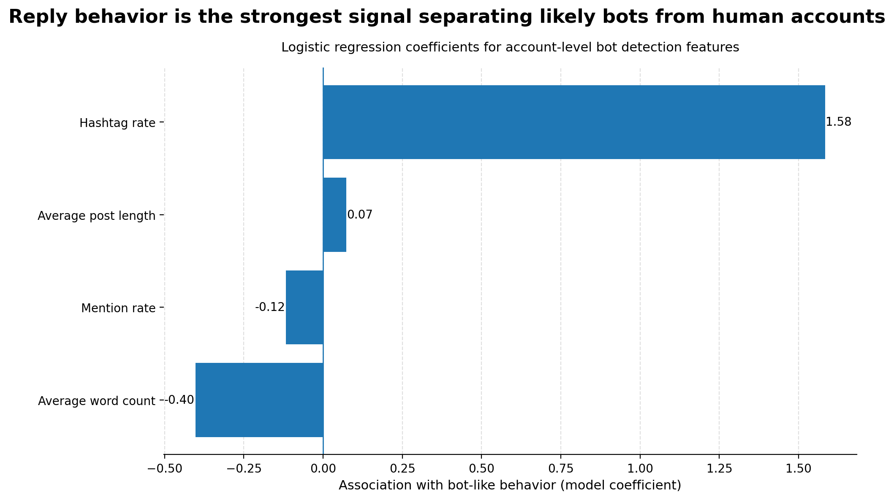

```python
import contextlib
import logging
import os
import sys
import time

import duckdb
import pandas as pd

# Logging
LOG_LEVEL = os.environ.get("PIPELINE_LOG_LEVEL", "INFO").upper()
logging.basicConfig(
    level=getattr(logging, LOG_LEVEL, logging.INFO),
    format="%(asctime)s | %(levelname)s | %(name)s | %(message)s",
    stream=sys.stdout,
)
logger = logging.getLogger("pipeline")


@contextlib.contextmanager
def log_step(step: str, **meta):
    t0 = time.perf_counter()
    meta_str = " ".join(f"{k}={v!r}" for k, v in meta.items())
    logger.info("START %s%s", step, (" " + meta_str) if meta_str else "")
    try:
        yield
    except Exception:
        logger.exception("FAIL %s%s", step, (" " + meta_str) if meta_str else "")
        raise
    finally:
        dt_s = time.perf_counter() - t0
        logger.info("END %s (%.2fs)", step, dt_s)

```

## Load/prep data


```python
# connect to db
with log_step("duckdb.connect", path="../bluesky.duckdb"):
    conn = duckdb.connect("../bluesky.duckdb")
```


```python
import duckdb

'''
Reads in 4 data files and creates tables in duckdb for them.
- posts
- accounts
- post_features
- account_features
'''

with log_step("duckdb.connect", path="social_bots.duckdb"):
    conn = duckdb.connect("social_bots.duckdb")

try:
    with log_step("load_parquet_tables"):
        conn.execute("""
        CREATE OR REPLACE TABLE posts AS
        SELECT * FROM read_parquet('../data/posts.parquet')
        """)

        conn.execute("""
        CREATE OR REPLACE TABLE accounts AS
        SELECT * FROM read_parquet('../data/accounts.parquet')
        """)

        conn.execute("""
        CREATE OR REPLACE TABLE post_features AS
        SELECT * FROM read_parquet('../data/post_features.parquet')
        """)

        conn.execute("""
        CREATE OR REPLACE TABLE account_features AS
        SELECT * FROM read_parquet('../data/account_features.parquet')
        """)

        counts = conn.execute(
            """
            SELECT 'posts' AS table, COUNT(*) AS n FROM posts
            UNION ALL SELECT 'accounts', COUNT(*) FROM accounts
            UNION ALL SELECT 'post_features', COUNT(*) FROM post_features
            UNION ALL SELECT 'account_features', COUNT(*) FROM account_features
            """
        ).df()
        logger.info("Loaded tables:\n%s", counts.to_string(index=False))
except Exception:
    logger.exception(
        "Failed to load one or more parquet files into DuckDB. "
        "Check that ../data/*.parquet exist and schemas are readable."
    )
    raise

```


    <_duckdb.DuckDBPyConnection at 0x121ba0b30>


```python
# Joined view of all tables using shared keys to visualize full dataset structure and relationships between account-level and post-level data.

df = conn.execute("""
SELECT 
    -- account-level (raw)
    a.did,
    a.first_seen_at,
    a.last_seen_at,
    a.post_count,

    -- account-level (features)
    af.reply_rate,
    af.url_rate,
    af.hashtag_rate,
    af.mention_rate,
    af.avg_post_length,
    af.avg_word_count,

    -- post-level (raw)
    p.id AS post_id,
    p.text,
    p.created_at,
    p.is_reply,

    -- post-level (features)
    pf.char_count,
    pf.word_count,
    pf.has_url,
    pf.has_hashtag,
    pf.has_mention

FROM accounts a
JOIN posts p 
    ON a.did = p.did
JOIN post_features pf 
    ON p.id = pf.post_id
JOIN account_features af 
    ON a.did = af.did

LIMIT 50
""").df()

df.head()
```


<div>
<style scoped>
    .dataframe tbody tr th:only-of-type {
        vertical-align: middle;
    }

    .dataframe tbody tr th {
        vertical-align: top;
    }

    .dataframe thead th {
        text-align: right;
    }
</style>
<table border="1" class="dataframe">
  <thead>
    <tr style="text-align: right;">
      <th></th>
      <th>did</th>
      <th>first_seen_at</th>
      <th>last_seen_at</th>
      <th>post_count</th>
      <th>reply_rate</th>
      <th>url_rate</th>
      <th>hashtag_rate</th>
      <th>mention_rate</th>
      <th>avg_post_length</th>
      <th>avg_word_count</th>
      <th>post_id</th>
      <th>text</th>
      <th>created_at</th>
      <th>is_reply</th>
      <th>char_count</th>
      <th>word_count</th>
      <th>has_url</th>
      <th>has_hashtag</th>
      <th>has_mention</th>
    </tr>
  </thead>
  <tbody>
    <tr>
      <th>0</th>
      <td>did:plc:lejpu7zrbsegoi75wpvm2sch</td>
      <td>2026-03-30 23:03:52.654</td>
      <td>2026-03-30 23:03:52.654</td>
      <td>1</td>
      <td>0.0</td>
      <td>0.0</td>
      <td>0.0</td>
      <td>0.0</td>
      <td>180.000000</td>
      <td>27.0</td>
      <td>at://did:plc:lejpu7zrbsegoi75wpvm2sch/app.bsky...</td>
      <td>American Idol 2026 Top 14 Revealed! Some big n...</td>
      <td>2026-03-30 23:03:52.654</td>
      <td>False</td>
      <td>180</td>
      <td>27</td>
      <td>0</td>
      <td>0</td>
      <td>0</td>
    </tr>
    <tr>
      <th>1</th>
      <td>did:plc:b5wp4fgce22ixrggskz3kwk6</td>
      <td>2026-03-30 23:03:57.650</td>
      <td>2026-03-30 23:03:57.650</td>
      <td>1</td>
      <td>0.0</td>
      <td>0.0</td>
      <td>0.0</td>
      <td>0.0</td>
      <td>5.000000</td>
      <td>1.0</td>
      <td>at://did:plc:b5wp4fgce22ixrggskz3kwk6/app.bsky...</td>
      <td>オムライス</td>
      <td>2026-03-30 23:03:57.650</td>
      <td>False</td>
      <td>5</td>
      <td>1</td>
      <td>0</td>
      <td>0</td>
      <td>0</td>
    </tr>
    <tr>
      <th>2</th>
      <td>did:plc:27uvdj4hkoxksgqs737uiyrp</td>
      <td>2026-03-30 23:04:05.422</td>
      <td>2026-03-30 23:04:05.422</td>
      <td>1</td>
      <td>0.0</td>
      <td>0.0</td>
      <td>0.0</td>
      <td>0.0</td>
      <td>17.000000</td>
      <td>1.0</td>
      <td>at://did:plc:27uvdj4hkoxksgqs737uiyrp/app.bsky...</td>
      <td>よし。本丸録届いたぽい（イン会社）</td>
      <td>2026-03-30 23:04:05.422</td>
      <td>False</td>
      <td>17</td>
      <td>1</td>
      <td>0</td>
      <td>0</td>
      <td>0</td>
    </tr>
    <tr>
      <th>3</th>
      <td>did:plc:fj2d6rwtqgkzz77iocgcuwk4</td>
      <td>2026-03-30 23:04:06.873</td>
      <td>2026-03-30 23:04:06.873</td>
      <td>1</td>
      <td>1.0</td>
      <td>0.0</td>
      <td>0.0</td>
      <td>0.0</td>
      <td>137.000000</td>
      <td>22.0</td>
      <td>at://did:plc:fj2d6rwtqgkzz77iocgcuwk4/app.bsky...</td>
      <td>everyday hormuz stays closed thats 20mbpd not ...</td>
      <td>2026-03-30 23:04:06.873</td>
      <td>True</td>
      <td>137</td>
      <td>22</td>
      <td>0</td>
      <td>0</td>
      <td>0</td>
    </tr>
    <tr>
      <th>4</th>
      <td>did:plc:nr3sk72qhacjuihqyy6sfplv</td>
      <td>2026-03-30 23:04:06.583</td>
      <td>2026-03-30 23:19:12.845</td>
      <td>3</td>
      <td>1.0</td>
      <td>0.0</td>
      <td>0.0</td>
      <td>0.0</td>
      <td>106.333333</td>
      <td>21.0</td>
      <td>at://did:plc:nr3sk72qhacjuihqyy6sfplv/app.bsky...</td>
      <td>realest shit i ever read on the internet right...</td>
      <td>2026-03-30 23:04:06.583</td>
      <td>True</td>
      <td>51</td>
      <td>10</td>
      <td>0</td>
      <td>0</td>
      <td>0</td>
    </tr>
  </tbody>
</table>
</div>


```python
df = conn.execute("""
SELECT 
    a.did,
    a.post_count as total_posts,
    af.reply_rate,
    af.url_rate,
    af.hashtag_rate,
    af.mention_rate,
    af.avg_post_length,
    af.avg_word_count
FROM accounts a
JOIN account_features af
    ON a.did = af.did
""").df()
```


```python
df.head()
```


<div>
<style scoped>
    .dataframe tbody tr th:only-of-type {
        vertical-align: middle;
    }

    .dataframe tbody tr th {
        vertical-align: top;
    }

    .dataframe thead th {
        text-align: right;
    }
</style>
<table border="1" class="dataframe">
  <thead>
    <tr style="text-align: right;">
      <th></th>
      <th>did</th>
      <th>total_posts</th>
      <th>reply_rate</th>
      <th>url_rate</th>
      <th>hashtag_rate</th>
      <th>mention_rate</th>
      <th>avg_post_length</th>
      <th>avg_word_count</th>
    </tr>
  </thead>
  <tbody>
    <tr>
      <th>0</th>
      <td>did:plc:6fi4ua55jhqdyix74q3tpbnh</td>
      <td>1</td>
      <td>0.0</td>
      <td>0.000000</td>
      <td>1.0</td>
      <td>0.0</td>
      <td>44.000000</td>
      <td>6.000000</td>
    </tr>
    <tr>
      <th>1</th>
      <td>did:plc:fe3dmo4esdbvqi4vvkek6xjs</td>
      <td>13</td>
      <td>0.0</td>
      <td>0.000000</td>
      <td>0.0</td>
      <td>0.0</td>
      <td>49.846154</td>
      <td>1.000000</td>
    </tr>
    <tr>
      <th>2</th>
      <td>did:plc:jgykciobnnrfzgpybaebwry6</td>
      <td>1</td>
      <td>1.0</td>
      <td>0.000000</td>
      <td>0.0</td>
      <td>0.0</td>
      <td>3.000000</td>
      <td>1.000000</td>
    </tr>
    <tr>
      <th>3</th>
      <td>did:plc:rojjr6zef7m2xpfdt6jw5fta</td>
      <td>7</td>
      <td>1.0</td>
      <td>0.142857</td>
      <td>0.0</td>
      <td>0.0</td>
      <td>19.285714</td>
      <td>3.714286</td>
    </tr>
    <tr>
      <th>4</th>
      <td>did:plc:owo2l6v35uvk3axlrkz6d2wt</td>
      <td>4</td>
      <td>0.0</td>
      <td>0.000000</td>
      <td>0.0</td>
      <td>0.0</td>
      <td>297.500000</td>
      <td>43.250000</td>
    </tr>
  </tbody>
</table>
</div>


## Logistic regression

### Analysis Rationale 


The biggest decision was how to define bot-like accounts without ground truth data. The goal of this analysis is to identify accounts that look bot-like based on their behavior. Since I don’t have true labeled data for bots vs. humans, I created labels using simple rules based on extreme patterns in the data. I chose to label accounts using percentile-based thresholds on posting frequency and URL usage, since these showed clear heavy-tailed distributions in the EDA. This approach prioritizes identifying extreme, high-confidence cases rather than trying to classify all accounts. The tradeoff is that it likely misses more subtle bots and may incorrectly flag some high-activity human accounts.

Accounts are labeled as bots if they have very high activity and URL usage (top 5%), and labeled as human if they have very low activity and behave more conversationally (low post count but higher reply rate). This isn’t perfect ground truth, but it gives a clean way to separate clearly different types of accounts so I can train a model.

One issue with this approach is data leakage. Some of the features used to create the labels (like total posts, URL rate, and reply rate) could make the model artificially accurate if they are also used as inputs. To avoid that, I removed those features from the model so it has to learn from other signals like hashtags, mentions, and text characteristics instead.

I used logistic regression because it’s simple and easy to interpret. The coefficients make it clear which behaviors are more associated with bot-like vs human-like accounts, which is useful for explaining the results.

The high accuracy should be interpreted carefully. Because the labels are based on extreme thresholds, the model is mostly learning to separate very obvious cases rather than solving a fully realistic classification problem. So this is better thought of as detecting accounts that match a “bot-like profile” rather than definitively identifying bots.

In addition to accuracy, I also evaluated the model using precision, recall, and F1 score to get a better sense of how well it identifies bot-like accounts. Accuracy alone can be misleading, especially when the classes are imbalanced or when labels are heuristic. Precision measures how reliable the bot predictions are (how many predicted bots are actually bot-like), while recall measures how many of the bot-like accounts the model is able to detect. The F1 score balances these two and gives a more complete view of performance.

In this case, the model achieves high precision for bot-like accounts, meaning that when it flags an account as a bot, it is usually correct. Recall is slightly lower, indicating that some bot-like accounts are not being detected. This suggests the model is somewhat conservative in labeling bots, prioritizing correctness over coverage. Overall, the F1 score reflects a strong balance between these two objectives, supporting the conclusion that the model is effective at identifying clear bot-like behavior while avoiding excessive false positives.

Overall, the approach demonstrates how relational data and feature engineering can be used to model behavior, while still acknowledging the limitations of the labeling strategy.

#### Preprocess/Labelling 


```python
# calculate 95th percentile thresholds for total posts and url_rate
post_thresh = df['total_posts'].quantile(0.95)
url_thresh = df['url_rate'].quantile(0.95)
```


```python
'''
label accounts as 1 if they have more than the post and url thresholds, 
otherwise label as 0 if they have 2 or fewer posts and a reply rate above 0.2, 
otherwise leave as None
'''

df["label"] = None

df.loc[
    (df["total_posts"] > post_thresh) & (df["url_rate"] > url_thresh),
    "label"
] = 1

df.loc[
    (df["total_posts"] <= 2) & (df["reply_rate"] > 0.2),
    "label"
] = 0
```


```python
# sanity check label distribution
df["label"].value_counts(dropna=False)
```


    label
    None    27701
    0       15081
    1         161
    Name: count, dtype: int64


```python
# drop unlabeled accounts and balance classes by randomly sampling from the majority class (humans)
df_labeled = df.dropna(subset=["label"])

bots = df_labeled[df_labeled["label"] == 1]
humans = df_labeled[df_labeled["label"] == 0].sample(len(bots), random_state=42)

df_balanced = pd.concat([bots, humans])
```

#### Training model (logistic regression)


```python
df_labeled = df.dropna(subset=["label"]).copy()
df_labeled["label"] = df_labeled["label"].astype(int)

bots = df_labeled[df_labeled["label"] == 1]
humans = df_labeled[df_labeled["label"] == 0].sample(len(bots), random_state=42)

df_balanced = pd.concat([bots, humans]).sample(frac=1, random_state=42)

X = df_balanced.drop(columns=["did", "label", "total_posts", "url_rate", "reply_rate"]) # drop columns used to derive labels
y = df_balanced["label"].astype(int)
```


```python
# train test split
from sklearn.model_selection import train_test_split

X_train, X_test, y_train, y_test = train_test_split(X, y, test_size=0.2)
```


```python
# train model (logistic regression)
from sklearn.linear_model import LogisticRegression

model = LogisticRegression(max_iter=1000, random_state=42)
model.fit(X_train, y_train)
```


<style>#sk-container-id-1 {
  /* Definition of color scheme common for light and dark mode */
  --sklearn-color-text: #000;
  --sklearn-color-text-muted: #666;
  --sklearn-color-line: gray;
  /* Definition of color scheme for unfitted estimators */
  --sklearn-color-unfitted-level-0: #fff5e6;
  --sklearn-color-unfitted-level-1: #f6e4d2;
  --sklearn-color-unfitted-level-2: #ffe0b3;
  --sklearn-color-unfitted-level-3: chocolate;
  /* Definition of color scheme for fitted estimators */
  --sklearn-color-fitted-level-0: #f0f8ff;
  --sklearn-color-fitted-level-1: #d4ebff;
  --sklearn-color-fitted-level-2: #b3dbfd;
  --sklearn-color-fitted-level-3: cornflowerblue;
}

#sk-container-id-1.light {
  /* Specific color for light theme */
  --sklearn-color-text-on-default-background: black;
  --sklearn-color-background: white;
  --sklearn-color-border-box: black;
  --sklearn-color-icon: #696969;
}

#sk-container-id-1.dark {
  --sklearn-color-text-on-default-background: white;
  --sklearn-color-background: #111;
  --sklearn-color-border-box: white;
  --sklearn-color-icon: #878787;
}

#sk-container-id-1 {
  color: var(--sklearn-color-text);
}

#sk-container-id-1 pre {
  padding: 0;
}

#sk-container-id-1 input.sk-hidden--visually {
  border: 0;
  clip: rect(1px 1px 1px 1px);
  clip: rect(1px, 1px, 1px, 1px);
  height: 1px;
  margin: -1px;
  overflow: hidden;
  padding: 0;
  position: absolute;
  width: 1px;
}

#sk-container-id-1 div.sk-dashed-wrapped {
  border: 1px dashed var(--sklearn-color-line);
  margin: 0 0.4em 0.5em 0.4em;
  box-sizing: border-box;
  padding-bottom: 0.4em;
  background-color: var(--sklearn-color-background);
}

#sk-container-id-1 div.sk-container {
  /* jupyter's `normalize.less` sets `[hidden] { display: none; }`
     but bootstrap.min.css set `[hidden] { display: none !important; }`
     so we also need the `!important` here to be able to override the
     default hidden behavior on the sphinx rendered scikit-learn.org.
     See: https://github.com/scikit-learn/scikit-learn/issues/21755 */
  display: inline-block !important;
  position: relative;
}

#sk-container-id-1 div.sk-text-repr-fallback {
  display: none;
}

div.sk-parallel-item,
div.sk-serial,
div.sk-item {
  /* draw centered vertical line to link estimators */
  background-image: linear-gradient(var(--sklearn-color-text-on-default-background), var(--sklearn-color-text-on-default-background));
  background-size: 2px 100%;
  background-repeat: no-repeat;
  background-position: center center;
}

/* Parallel-specific style estimator block */

#sk-container-id-1 div.sk-parallel-item::after {
  content: "";
  width: 100%;
  border-bottom: 2px solid var(--sklearn-color-text-on-default-background);
  flex-grow: 1;
}

#sk-container-id-1 div.sk-parallel {
  display: flex;
  align-items: stretch;
  justify-content: center;
  background-color: var(--sklearn-color-background);
  position: relative;
}

#sk-container-id-1 div.sk-parallel-item {
  display: flex;
  flex-direction: column;
}

#sk-container-id-1 div.sk-parallel-item:first-child::after {
  align-self: flex-end;
  width: 50%;
}

#sk-container-id-1 div.sk-parallel-item:last-child::after {
  align-self: flex-start;
  width: 50%;
}

#sk-container-id-1 div.sk-parallel-item:only-child::after {
  width: 0;
}

/* Serial-specific style estimator block */

#sk-container-id-1 div.sk-serial {
  display: flex;
  flex-direction: column;
  align-items: center;
  background-color: var(--sklearn-color-background);
  padding-right: 1em;
  padding-left: 1em;
}


/* Toggleable style: style used for estimator/Pipeline/ColumnTransformer box that is
clickable and can be expanded/collapsed.
- Pipeline and ColumnTransformer use this feature and define the default style
- Estimators will overwrite some part of the style using the `sk-estimator` class
*/

/* Pipeline and ColumnTransformer style (default) */

#sk-container-id-1 div.sk-toggleable {
  /* Default theme specific background. It is overwritten whether we have a
  specific estimator or a Pipeline/ColumnTransformer */
  background-color: var(--sklearn-color-background);
}

/* Toggleable label */
#sk-container-id-1 label.sk-toggleable__label {
  cursor: pointer;
  display: flex;
  width: 100%;
  margin-bottom: 0;
  padding: 0.5em;
  box-sizing: border-box;
  text-align: center;
  align-items: center;
  justify-content: center;
  gap: 0.5em;
}

#sk-container-id-1 label.sk-toggleable__label .caption {
  font-size: 0.6rem;
  font-weight: lighter;
  color: var(--sklearn-color-text-muted);
}

#sk-container-id-1 label.sk-toggleable__label-arrow:before {
  /* Arrow on the left of the label */
  content: "▸";
  float: left;
  margin-right: 0.25em;
  color: var(--sklearn-color-icon);
}

#sk-container-id-1 label.sk-toggleable__label-arrow:hover:before {
  color: var(--sklearn-color-text);
}

/* Toggleable content - dropdown */

#sk-container-id-1 div.sk-toggleable__content {
  display: none;
  text-align: left;
  /* unfitted */
  background-color: var(--sklearn-color-unfitted-level-0);
}

#sk-container-id-1 div.sk-toggleable__content.fitted {
  /* fitted */
  background-color: var(--sklearn-color-fitted-level-0);
}

#sk-container-id-1 div.sk-toggleable__content pre {
  margin: 0.2em;
  border-radius: 0.25em;
  color: var(--sklearn-color-text);
  /* unfitted */
  background-color: var(--sklearn-color-unfitted-level-0);
}

#sk-container-id-1 div.sk-toggleable__content.fitted pre {
  /* unfitted */
  background-color: var(--sklearn-color-fitted-level-0);
}

#sk-container-id-1 input.sk-toggleable__control:checked~div.sk-toggleable__content {
  /* Expand drop-down */
  display: block;
  width: 100%;
  overflow: visible;
}

#sk-container-id-1 input.sk-toggleable__control:checked~label.sk-toggleable__label-arrow:before {
  content: "▾";
}

/* Pipeline/ColumnTransformer-specific style */

#sk-container-id-1 div.sk-label input.sk-toggleable__control:checked~label.sk-toggleable__label {
  color: var(--sklearn-color-text);
  background-color: var(--sklearn-color-unfitted-level-2);
}

#sk-container-id-1 div.sk-label.fitted input.sk-toggleable__control:checked~label.sk-toggleable__label {
  background-color: var(--sklearn-color-fitted-level-2);
}

/* Estimator-specific style */

/* Colorize estimator box */
#sk-container-id-1 div.sk-estimator input.sk-toggleable__control:checked~label.sk-toggleable__label {
  /* unfitted */
  background-color: var(--sklearn-color-unfitted-level-2);
}

#sk-container-id-1 div.sk-estimator.fitted input.sk-toggleable__control:checked~label.sk-toggleable__label {
  /* fitted */
  background-color: var(--sklearn-color-fitted-level-2);
}

#sk-container-id-1 div.sk-label label.sk-toggleable__label,
#sk-container-id-1 div.sk-label label {
  /* The background is the default theme color */
  color: var(--sklearn-color-text-on-default-background);
}

/* On hover, darken the color of the background */
#sk-container-id-1 div.sk-label:hover label.sk-toggleable__label {
  color: var(--sklearn-color-text);
  background-color: var(--sklearn-color-unfitted-level-2);
}

/* Label box, darken color on hover, fitted */
#sk-container-id-1 div.sk-label.fitted:hover label.sk-toggleable__label.fitted {
  color: var(--sklearn-color-text);
  background-color: var(--sklearn-color-fitted-level-2);
}

/* Estimator label */

#sk-container-id-1 div.sk-label label {
  font-family: monospace;
  font-weight: bold;
  line-height: 1.2em;
}

#sk-container-id-1 div.sk-label-container {
  text-align: center;
}

/* Estimator-specific */
#sk-container-id-1 div.sk-estimator {
  font-family: monospace;
  border: 1px dotted var(--sklearn-color-border-box);
  border-radius: 0.25em;
  box-sizing: border-box;
  margin-bottom: 0.5em;
  /* unfitted */
  background-color: var(--sklearn-color-unfitted-level-0);
}

#sk-container-id-1 div.sk-estimator.fitted {
  /* fitted */
  background-color: var(--sklearn-color-fitted-level-0);
}

/* on hover */
#sk-container-id-1 div.sk-estimator:hover {
  /* unfitted */
  background-color: var(--sklearn-color-unfitted-level-2);
}

#sk-container-id-1 div.sk-estimator.fitted:hover {
  /* fitted */
  background-color: var(--sklearn-color-fitted-level-2);
}

/* Specification for estimator info (e.g. "i" and "?") */

/* Common style for "i" and "?" */

.sk-estimator-doc-link,
a:link.sk-estimator-doc-link,
a:visited.sk-estimator-doc-link {
  float: right;
  font-size: smaller;
  line-height: 1em;
  font-family: monospace;
  background-color: var(--sklearn-color-unfitted-level-0);
  border-radius: 1em;
  height: 1em;
  width: 1em;
  text-decoration: none !important;
  margin-left: 0.5em;
  text-align: center;
  /* unfitted */
  border: var(--sklearn-color-unfitted-level-3) 1pt solid;
  color: var(--sklearn-color-unfitted-level-3);
}

.sk-estimator-doc-link.fitted,
a:link.sk-estimator-doc-link.fitted,
a:visited.sk-estimator-doc-link.fitted {
  /* fitted */
  background-color: var(--sklearn-color-fitted-level-0);
  border: var(--sklearn-color-fitted-level-3) 1pt solid;
  color: var(--sklearn-color-fitted-level-3);
}

/* On hover */
div.sk-estimator:hover .sk-estimator-doc-link:hover,
.sk-estimator-doc-link:hover,
div.sk-label-container:hover .sk-estimator-doc-link:hover,
.sk-estimator-doc-link:hover {
  /* unfitted */
  background-color: var(--sklearn-color-unfitted-level-3);
  border: var(--sklearn-color-fitted-level-0) 1pt solid;
  color: var(--sklearn-color-unfitted-level-0);
  text-decoration: none;
}

div.sk-estimator.fitted:hover .sk-estimator-doc-link.fitted:hover,
.sk-estimator-doc-link.fitted:hover,
div.sk-label-container:hover .sk-estimator-doc-link.fitted:hover,
.sk-estimator-doc-link.fitted:hover {
  /* fitted */
  background-color: var(--sklearn-color-fitted-level-3);
  border: var(--sklearn-color-fitted-level-0) 1pt solid;
  color: var(--sklearn-color-fitted-level-0);
  text-decoration: none;
}

/* Span, style for the box shown on hovering the info icon */
.sk-estimator-doc-link span {
  display: none;
  z-index: 9999;
  position: relative;
  font-weight: normal;
  right: .2ex;
  padding: .5ex;
  margin: .5ex;
  width: min-content;
  min-width: 20ex;
  max-width: 50ex;
  color: var(--sklearn-color-text);
  box-shadow: 2pt 2pt 4pt #999;
  /* unfitted */
  background: var(--sklearn-color-unfitted-level-0);
  border: .5pt solid var(--sklearn-color-unfitted-level-3);
}

.sk-estimator-doc-link.fitted span {
  /* fitted */
  background: var(--sklearn-color-fitted-level-0);
  border: var(--sklearn-color-fitted-level-3);
}

.sk-estimator-doc-link:hover span {
  display: block;
}

/* "?"-specific style due to the `<a>` HTML tag */

#sk-container-id-1 a.estimator_doc_link {
  float: right;
  font-size: 1rem;
  line-height: 1em;
  font-family: monospace;
  background-color: var(--sklearn-color-unfitted-level-0);
  border-radius: 1rem;
  height: 1rem;
  width: 1rem;
  text-decoration: none;
  /* unfitted */
  color: var(--sklearn-color-unfitted-level-1);
  border: var(--sklearn-color-unfitted-level-1) 1pt solid;
}

#sk-container-id-1 a.estimator_doc_link.fitted {
  /* fitted */
  background-color: var(--sklearn-color-fitted-level-0);
  border: var(--sklearn-color-fitted-level-1) 1pt solid;
  color: var(--sklearn-color-fitted-level-1);
}

/* On hover */
#sk-container-id-1 a.estimator_doc_link:hover {
  /* unfitted */
  background-color: var(--sklearn-color-unfitted-level-3);
  color: var(--sklearn-color-background);
  text-decoration: none;
}

#sk-container-id-1 a.estimator_doc_link.fitted:hover {
  /* fitted */
  background-color: var(--sklearn-color-fitted-level-3);
}

.estimator-table {
    font-family: monospace;
}

.estimator-table summary {
    padding: .5rem;
    cursor: pointer;
}

.estimator-table summary::marker {
    font-size: 0.7rem;
}

.estimator-table details[open] {
    padding-left: 0.1rem;
    padding-right: 0.1rem;
    padding-bottom: 0.3rem;
}

.estimator-table .parameters-table {
    margin-left: auto !important;
    margin-right: auto !important;
    margin-top: 0;
}

.estimator-table .parameters-table tr:nth-child(odd) {
    background-color: #fff;
}

.estimator-table .parameters-table tr:nth-child(even) {
    background-color: #f6f6f6;
}

.estimator-table .parameters-table tr:hover {
    background-color: #e0e0e0;
}

.estimator-table table td {
    border: 1px solid rgba(106, 105, 104, 0.232);
}

/*
    `table td`is set in notebook with right text-align.
    We need to overwrite it.
*/
.estimator-table table td.param {
    text-align: left;
    position: relative;
    padding: 0;
}

.user-set td {
    color:rgb(255, 94, 0);
    text-align: left !important;
}

.user-set td.value {
    color:rgb(255, 94, 0);
    background-color: transparent;
}

.default td {
    color: black;
    text-align: left !important;
}

.user-set td i,
.default td i {
    color: black;
}

/*
    Styles for parameter documentation links
    We need styling for visited so jupyter doesn't overwrite it
*/
a.param-doc-link,
a.param-doc-link:link,
a.param-doc-link:visited {
    text-decoration: underline dashed;
    text-underline-offset: .3em;
    color: inherit;
    display: block;
    padding: .5em;
}

/* "hack" to make the entire area of the cell containing the link clickable */
a.param-doc-link::before {
    position: absolute;
    content: "";
    inset: 0;
}

.param-doc-description {
    display: none;
    position: absolute;
    z-index: 9999;
    left: 0;
    padding: .5ex;
    margin-left: 1.5em;
    color: var(--sklearn-color-text);
    box-shadow: .3em .3em .4em #999;
    width: max-content;
    text-align: left;
    max-height: 10em;
    overflow-y: auto;

    /* unfitted */
    background: var(--sklearn-color-unfitted-level-0);
    border: thin solid var(--sklearn-color-unfitted-level-3);
}

/* Fitted state for parameter tooltips */
.fitted .param-doc-description {
    /* fitted */
    background: var(--sklearn-color-fitted-level-0);
    border: thin solid var(--sklearn-color-fitted-level-3);
}

.param-doc-link:hover .param-doc-description {
    display: block;
}

.copy-paste-icon {
    background-image: url(data:image/svg+xml;base64,PHN2ZyB4bWxucz0iaHR0cDovL3d3dy53My5vcmcvMjAwMC9zdmciIHZpZXdCb3g9IjAgMCA0NDggNTEyIj48IS0tIUZvbnQgQXdlc29tZSBGcmVlIDYuNy4yIGJ5IEBmb250YXdlc29tZSAtIGh0dHBzOi8vZm9udGF3ZXNvbWUuY29tIExpY2Vuc2UgLSBodHRwczovL2ZvbnRhd2Vzb21lLmNvbS9saWNlbnNlL2ZyZWUgQ29weXJpZ2h0IDIwMjUgRm9udGljb25zLCBJbmMuLS0+PHBhdGggZD0iTTIwOCAwTDMzMi4xIDBjMTIuNyAwIDI0LjkgNS4xIDMzLjkgMTQuMWw2Ny45IDY3LjljOSA5IDE0LjEgMjEuMiAxNC4xIDMzLjlMNDQ4IDMzNmMwIDI2LjUtMjEuNSA0OC00OCA0OGwtMTkyIDBjLTI2LjUgMC00OC0yMS41LTQ4LTQ4bDAtMjg4YzAtMjYuNSAyMS41LTQ4IDQ4LTQ4ek00OCAxMjhsODAgMCAwIDY0LTY0IDAgMCAyNTYgMTkyIDAgMC0zMiA2NCAwIDAgNDhjMCAyNi41LTIxLjUgNDgtNDggNDhMNDggNTEyYy0yNi41IDAtNDgtMjEuNS00OC00OEwwIDE3NmMwLTI2LjUgMjEuNS00OCA0OC00OHoiLz48L3N2Zz4=);
    background-repeat: no-repeat;
    background-size: 14px 14px;
    background-position: 0;
    display: inline-block;
    width: 14px;
    height: 14px;
    cursor: pointer;
}
</style><body><div id="sk-container-id-1" class="sk-top-container"><div class="sk-text-repr-fallback"><pre>LogisticRegression(max_iter=1000, random_state=42)</pre><b>In a Jupyter environment, please rerun this cell to show the HTML representation or trust the notebook. <br />On GitHub, the HTML representation is unable to render, please try loading this page with nbviewer.org.</b></div><div class="sk-container" hidden><div class="sk-item"><div class="sk-estimator fitted sk-toggleable"><input class="sk-toggleable__control sk-hidden--visually" id="sk-estimator-id-1" type="checkbox" checked><label for="sk-estimator-id-1" class="sk-toggleable__label fitted sk-toggleable__label-arrow"><div><div>LogisticRegression</div></div><div><a class="sk-estimator-doc-link fitted" rel="noreferrer" target="_blank" href="https://scikit-learn.org/1.8/modules/generated/sklearn.linear_model.LogisticRegression.html">?<span>Documentation for LogisticRegression</span></a><span class="sk-estimator-doc-link fitted">i<span>Fitted</span></span></div></label><div class="sk-toggleable__content fitted" data-param-prefix="">
        <div class="estimator-table">
            <details>
                <summary>Parameters</summary>
                <table class="parameters-table">
                  <tbody>

        <tr class="default">
            <td><i class="copy-paste-icon"
                 onclick="copyToClipboard('penalty',
                          this.parentElement.nextElementSibling)"
            ></i></td>
            <td class="param">
        <a class="param-doc-link"
            rel="noreferrer" target="_blank" href="https://scikit-learn.org/1.8/modules/generated/sklearn.linear_model.LogisticRegression.html#:~:text=penalty,-%7B%27l1%27%2C%20%27l2%27%2C%20%27elasticnet%27%2C%20None%7D%2C%20default%3D%27l2%27">
            penalty
            <span class="param-doc-description">penalty: {'l1', 'l2', 'elasticnet', None}, default='l2'<br><br>Specify the norm of the penalty:<br><br>- `None`: no penalty is added;<br>- `'l2'`: add a L2 penalty term and it is the default choice;<br>- `'l1'`: add a L1 penalty term;<br>- `'elasticnet'`: both L1 and L2 penalty terms are added.<br><br>.. warning::<br>   Some penalties may not work with some solvers. See the parameter<br>   `solver` below, to know the compatibility between the penalty and<br>   solver.<br><br>.. versionadded:: 0.19<br>   l1 penalty with SAGA solver (allowing 'multinomial' + L1)<br><br>.. deprecated:: 1.8<br>   `penalty` was deprecated in version 1.8 and will be removed in 1.10.<br>   Use `l1_ratio` instead. `l1_ratio=0` for `penalty='l2'`, `l1_ratio=1` for<br>   `penalty='l1'` and `l1_ratio` set to any float between 0 and 1 for<br>   `'penalty='elasticnet'`.</span>
        </a>
    </td>
            <td class="value">&#x27;deprecated&#x27;</td>
        </tr>


        <tr class="default">
            <td><i class="copy-paste-icon"
                 onclick="copyToClipboard('C',
                          this.parentElement.nextElementSibling)"
            ></i></td>
            <td class="param">
        <a class="param-doc-link"
            rel="noreferrer" target="_blank" href="https://scikit-learn.org/1.8/modules/generated/sklearn.linear_model.LogisticRegression.html#:~:text=C,-float%2C%20default%3D1.0">
            C
            <span class="param-doc-description">C: float, default=1.0<br><br>Inverse of regularization strength; must be a positive float.<br>Like in support vector machines, smaller values specify stronger<br>regularization. `C=np.inf` results in unpenalized logistic regression.<br>For a visual example on the effect of tuning the `C` parameter<br>with an L1 penalty, see:<br>:ref:`sphx_glr_auto_examples_linear_model_plot_logistic_path.py`.</span>
        </a>
    </td>
            <td class="value">1.0</td>
        </tr>


        <tr class="default">
            <td><i class="copy-paste-icon"
                 onclick="copyToClipboard('l1_ratio',
                          this.parentElement.nextElementSibling)"
            ></i></td>
            <td class="param">
        <a class="param-doc-link"
            rel="noreferrer" target="_blank" href="https://scikit-learn.org/1.8/modules/generated/sklearn.linear_model.LogisticRegression.html#:~:text=l1_ratio,-float%2C%20default%3D0.0">
            l1_ratio
            <span class="param-doc-description">l1_ratio: float, default=0.0<br><br>The Elastic-Net mixing parameter, with `0 <= l1_ratio <= 1`. Setting<br>`l1_ratio=1` gives a pure L1-penalty, setting `l1_ratio=0` a pure L2-penalty.<br>Any value between 0 and 1 gives an Elastic-Net penalty of the form<br>`l1_ratio * L1 + (1 - l1_ratio) * L2`.<br><br>.. warning::<br>   Certain values of `l1_ratio`, i.e. some penalties, may not work with some<br>   solvers. See the parameter `solver` below, to know the compatibility between<br>   the penalty and solver.<br><br>.. versionchanged:: 1.8<br>    Default value changed from None to 0.0.<br><br>.. deprecated:: 1.8<br>    `None` is deprecated and will be removed in version 1.10. Always use<br>    `l1_ratio` to specify the penalty type.</span>
        </a>
    </td>
            <td class="value">0.0</td>
        </tr>


        <tr class="default">
            <td><i class="copy-paste-icon"
                 onclick="copyToClipboard('dual',
                          this.parentElement.nextElementSibling)"
            ></i></td>
            <td class="param">
        <a class="param-doc-link"
            rel="noreferrer" target="_blank" href="https://scikit-learn.org/1.8/modules/generated/sklearn.linear_model.LogisticRegression.html#:~:text=dual,-bool%2C%20default%3DFalse">
            dual
            <span class="param-doc-description">dual: bool, default=False<br><br>Dual (constrained) or primal (regularized, see also<br>:ref:`this equation <regularized-logistic-loss>`) formulation. Dual formulation<br>is only implemented for l2 penalty with liblinear solver. Prefer `dual=False`<br>when n_samples > n_features.</span>
        </a>
    </td>
            <td class="value">False</td>
        </tr>


        <tr class="default">
            <td><i class="copy-paste-icon"
                 onclick="copyToClipboard('tol',
                          this.parentElement.nextElementSibling)"
            ></i></td>
            <td class="param">
        <a class="param-doc-link"
            rel="noreferrer" target="_blank" href="https://scikit-learn.org/1.8/modules/generated/sklearn.linear_model.LogisticRegression.html#:~:text=tol,-float%2C%20default%3D1e-4">
            tol
            <span class="param-doc-description">tol: float, default=1e-4<br><br>Tolerance for stopping criteria.</span>
        </a>
    </td>
            <td class="value">0.0001</td>
        </tr>


        <tr class="default">
            <td><i class="copy-paste-icon"
                 onclick="copyToClipboard('fit_intercept',
                          this.parentElement.nextElementSibling)"
            ></i></td>
            <td class="param">
        <a class="param-doc-link"
            rel="noreferrer" target="_blank" href="https://scikit-learn.org/1.8/modules/generated/sklearn.linear_model.LogisticRegression.html#:~:text=fit_intercept,-bool%2C%20default%3DTrue">
            fit_intercept
            <span class="param-doc-description">fit_intercept: bool, default=True<br><br>Specifies if a constant (a.k.a. bias or intercept) should be<br>added to the decision function.</span>
        </a>
    </td>
            <td class="value">True</td>
        </tr>


        <tr class="default">
            <td><i class="copy-paste-icon"
                 onclick="copyToClipboard('intercept_scaling',
                          this.parentElement.nextElementSibling)"
            ></i></td>
            <td class="param">
        <a class="param-doc-link"
            rel="noreferrer" target="_blank" href="https://scikit-learn.org/1.8/modules/generated/sklearn.linear_model.LogisticRegression.html#:~:text=intercept_scaling,-float%2C%20default%3D1">
            intercept_scaling
            <span class="param-doc-description">intercept_scaling: float, default=1<br><br>Useful only when the solver `liblinear` is used<br>and `self.fit_intercept` is set to `True`. In this case, `x` becomes<br>`[x, self.intercept_scaling]`,<br>i.e. a "synthetic" feature with constant value equal to<br>`intercept_scaling` is appended to the instance vector.<br>The intercept becomes<br>``intercept_scaling * synthetic_feature_weight``.<br><br>.. note::<br>    The synthetic feature weight is subject to L1 or L2<br>    regularization as all other features.<br>    To lessen the effect of regularization on synthetic feature weight<br>    (and therefore on the intercept) `intercept_scaling` has to be increased.</span>
        </a>
    </td>
            <td class="value">1</td>
        </tr>


        <tr class="default">
            <td><i class="copy-paste-icon"
                 onclick="copyToClipboard('class_weight',
                          this.parentElement.nextElementSibling)"
            ></i></td>
            <td class="param">
        <a class="param-doc-link"
            rel="noreferrer" target="_blank" href="https://scikit-learn.org/1.8/modules/generated/sklearn.linear_model.LogisticRegression.html#:~:text=class_weight,-dict%20or%20%27balanced%27%2C%20default%3DNone">
            class_weight
            <span class="param-doc-description">class_weight: dict or 'balanced', default=None<br><br>Weights associated with classes in the form ``{class_label: weight}``.<br>If not given, all classes are supposed to have weight one.<br><br>The "balanced" mode uses the values of y to automatically adjust<br>weights inversely proportional to class frequencies in the input data<br>as ``n_samples / (n_classes * np.bincount(y))``.<br><br>Note that these weights will be multiplied with sample_weight (passed<br>through the fit method) if sample_weight is specified.<br><br>.. versionadded:: 0.17<br>   *class_weight='balanced'*</span>
        </a>
    </td>
            <td class="value">None</td>
        </tr>


        <tr class="user-set">
            <td><i class="copy-paste-icon"
                 onclick="copyToClipboard('random_state',
                          this.parentElement.nextElementSibling)"
            ></i></td>
            <td class="param">
        <a class="param-doc-link"
            rel="noreferrer" target="_blank" href="https://scikit-learn.org/1.8/modules/generated/sklearn.linear_model.LogisticRegression.html#:~:text=random_state,-int%2C%20RandomState%20instance%2C%20default%3DNone">
            random_state
            <span class="param-doc-description">random_state: int, RandomState instance, default=None<br><br>Used when ``solver`` == 'sag', 'saga' or 'liblinear' to shuffle the<br>data. See :term:`Glossary <random_state>` for details.</span>
        </a>
    </td>
            <td class="value">42</td>
        </tr>


        <tr class="default">
            <td><i class="copy-paste-icon"
                 onclick="copyToClipboard('solver',
                          this.parentElement.nextElementSibling)"
            ></i></td>
            <td class="param">
        <a class="param-doc-link"
            rel="noreferrer" target="_blank" href="https://scikit-learn.org/1.8/modules/generated/sklearn.linear_model.LogisticRegression.html#:~:text=solver,-%7B%27lbfgs%27%2C%20%27liblinear%27%2C%20%27newton-cg%27%2C%20%27newton-cholesky%27%2C%20%27sag%27%2C%20%27saga%27%7D%2C%20%20%20%20%20%20%20%20%20%20%20%20%20default%3D%27lbfgs%27">
            solver
            <span class="param-doc-description">solver: {'lbfgs', 'liblinear', 'newton-cg', 'newton-cholesky', 'sag', 'saga'},             default='lbfgs'<br><br>Algorithm to use in the optimization problem. Default is 'lbfgs'.<br>To choose a solver, you might want to consider the following aspects:<br><br>- 'lbfgs' is a good default solver because it works reasonably well for a wide<br>  class of problems.<br>- For :term:`multiclass` problems (`n_classes >= 3`), all solvers except<br>  'liblinear' minimize the full multinomial loss, 'liblinear' will raise an<br>  error.<br>- 'newton-cholesky' is a good choice for<br>  `n_samples` >> `n_features * n_classes`, especially with one-hot encoded<br>  categorical features with rare categories. Be aware that the memory usage<br>  of this solver has a quadratic dependency on `n_features * n_classes`<br>  because it explicitly computes the full Hessian matrix.<br>- For small datasets, 'liblinear' is a good choice, whereas 'sag'<br>  and 'saga' are faster for large ones;<br>- 'liblinear' can only handle binary classification by default. To apply a<br>  one-versus-rest scheme for the multiclass setting one can wrap it with the<br>  :class:`~sklearn.multiclass.OneVsRestClassifier`.<br><br>.. warning::<br>   The choice of the algorithm depends on the penalty chosen (`l1_ratio=0`<br>   for L2-penalty, `l1_ratio=1` for L1-penalty and `0 < l1_ratio < 1` for<br>   Elastic-Net) and on (multinomial) multiclass support:<br><br>   ================= ======================== ======================<br>   solver            l1_ratio                 multinomial multiclass<br>   ================= ======================== ======================<br>   'lbfgs'           l1_ratio=0               yes<br>   'liblinear'       l1_ratio=1 or l1_ratio=0 no<br>   'newton-cg'       l1_ratio=0               yes<br>   'newton-cholesky' l1_ratio=0               yes<br>   'sag'             l1_ratio=0               yes<br>   'saga'            0<=l1_ratio<=1           yes<br>   ================= ======================== ======================<br><br>.. note::<br>   'sag' and 'saga' fast convergence is only guaranteed on features<br>   with approximately the same scale. You can preprocess the data with<br>   a scaler from :mod:`sklearn.preprocessing`.<br><br>.. seealso::<br>   Refer to the :ref:`User Guide <Logistic_regression>` for more<br>   information regarding :class:`LogisticRegression` and more specifically the<br>   :ref:`Table <logistic_regression_solvers>`<br>   summarizing solver/penalty supports.<br><br>.. versionadded:: 0.17<br>   Stochastic Average Gradient (SAG) descent solver. Multinomial support in<br>   version 0.18.<br>.. versionadded:: 0.19<br>   SAGA solver.<br>.. versionchanged:: 0.22<br>   The default solver changed from 'liblinear' to 'lbfgs' in 0.22.<br>.. versionadded:: 1.2<br>   newton-cholesky solver. Multinomial support in version 1.6.</span>
        </a>
    </td>
            <td class="value">&#x27;lbfgs&#x27;</td>
        </tr>


        <tr class="user-set">
            <td><i class="copy-paste-icon"
                 onclick="copyToClipboard('max_iter',
                          this.parentElement.nextElementSibling)"
            ></i></td>
            <td class="param">
        <a class="param-doc-link"
            rel="noreferrer" target="_blank" href="https://scikit-learn.org/1.8/modules/generated/sklearn.linear_model.LogisticRegression.html#:~:text=max_iter,-int%2C%20default%3D100">
            max_iter
            <span class="param-doc-description">max_iter: int, default=100<br><br>Maximum number of iterations taken for the solvers to converge.</span>
        </a>
    </td>
            <td class="value">1000</td>
        </tr>


        <tr class="default">
            <td><i class="copy-paste-icon"
                 onclick="copyToClipboard('verbose',
                          this.parentElement.nextElementSibling)"
            ></i></td>
            <td class="param">
        <a class="param-doc-link"
            rel="noreferrer" target="_blank" href="https://scikit-learn.org/1.8/modules/generated/sklearn.linear_model.LogisticRegression.html#:~:text=verbose,-int%2C%20default%3D0">
            verbose
            <span class="param-doc-description">verbose: int, default=0<br><br>For the liblinear and lbfgs solvers set verbose to any positive<br>number for verbosity.</span>
        </a>
    </td>
            <td class="value">0</td>
        </tr>


        <tr class="default">
            <td><i class="copy-paste-icon"
                 onclick="copyToClipboard('warm_start',
                          this.parentElement.nextElementSibling)"
            ></i></td>
            <td class="param">
        <a class="param-doc-link"
            rel="noreferrer" target="_blank" href="https://scikit-learn.org/1.8/modules/generated/sklearn.linear_model.LogisticRegression.html#:~:text=warm_start,-bool%2C%20default%3DFalse">
            warm_start
            <span class="param-doc-description">warm_start: bool, default=False<br><br>When set to True, reuse the solution of the previous call to fit as<br>initialization, otherwise, just erase the previous solution.<br>Useless for liblinear solver. See :term:`the Glossary <warm_start>`.<br><br>.. versionadded:: 0.17<br>   *warm_start* to support *lbfgs*, *newton-cg*, *sag*, *saga* solvers.</span>
        </a>
    </td>
            <td class="value">False</td>
        </tr>


        <tr class="default">
            <td><i class="copy-paste-icon"
                 onclick="copyToClipboard('n_jobs',
                          this.parentElement.nextElementSibling)"
            ></i></td>
            <td class="param">
        <a class="param-doc-link"
            rel="noreferrer" target="_blank" href="https://scikit-learn.org/1.8/modules/generated/sklearn.linear_model.LogisticRegression.html#:~:text=n_jobs,-int%2C%20default%3DNone">
            n_jobs
            <span class="param-doc-description">n_jobs: int, default=None<br><br>Does not have any effect.<br><br>.. deprecated:: 1.8<br>   `n_jobs` is deprecated in version 1.8 and will be removed in 1.10.</span>
        </a>
    </td>
            <td class="value">None</td>
        </tr>

                  </tbody>
                </table>
            </details>
        </div>
    </div></div></div></div></div><script>function copyToClipboard(text, element) {
    // Get the parameter prefix from the closest toggleable content
    const toggleableContent = element.closest('.sk-toggleable__content');
    const paramPrefix = toggleableContent ? toggleableContent.dataset.paramPrefix : '';
    const fullParamName = paramPrefix ? `${paramPrefix}${text}` : text;

    const originalStyle = element.style;
    const computedStyle = window.getComputedStyle(element);
    const originalWidth = computedStyle.width;
    const originalHTML = element.innerHTML.replace('Copied!', '');

    navigator.clipboard.writeText(fullParamName)
        .then(() => {
            element.style.width = originalWidth;
            element.style.color = 'green';
            element.innerHTML = "Copied!";

            setTimeout(() => {
                element.innerHTML = originalHTML;
                element.style = originalStyle;
            }, 2000);
        })
        .catch(err => {
            console.error('Failed to copy:', err);
            element.style.color = 'red';
            element.innerHTML = "Failed!";
            setTimeout(() => {
                element.innerHTML = originalHTML;
                element.style = originalStyle;
            }, 2000);
        });
    return false;
}

document.querySelectorAll('.copy-paste-icon').forEach(function(element) {
    const toggleableContent = element.closest('.sk-toggleable__content');
    const paramPrefix = toggleableContent ? toggleableContent.dataset.paramPrefix : '';
    const paramName = element.parentElement.nextElementSibling
        .textContent.trim().split(' ')[0];
    const fullParamName = paramPrefix ? `${paramPrefix}${paramName}` : paramName;

    element.setAttribute('title', fullParamName);
});


/**
 * Adapted from Skrub
 * https://github.com/skrub-data/skrub/blob/403466d1d5d4dc76a7ef569b3f8228db59a31dc3/skrub/_reporting/_data/templates/report.js#L789
 * @returns "light" or "dark"
 */
function detectTheme(element) {
    const body = document.querySelector('body');

    // Check VSCode theme
    const themeKindAttr = body.getAttribute('data-vscode-theme-kind');
    const themeNameAttr = body.getAttribute('data-vscode-theme-name');

    if (themeKindAttr && themeNameAttr) {
        const themeKind = themeKindAttr.toLowerCase();
        const themeName = themeNameAttr.toLowerCase();

        if (themeKind.includes("dark") || themeName.includes("dark")) {
            return "dark";
        }
        if (themeKind.includes("light") || themeName.includes("light")) {
            return "light";
        }
    }

    // Check Jupyter theme
    if (body.getAttribute('data-jp-theme-light') === 'false') {
        return 'dark';
    } else if (body.getAttribute('data-jp-theme-light') === 'true') {
        return 'light';
    }

    // Guess based on a parent element's color
    const color = window.getComputedStyle(element.parentNode, null).getPropertyValue('color');
    const match = color.match(/^rgb\s*\(\s*(\d+)\s*,\s*(\d+)\s*,\s*(\d+)\s*\)\s*$/i);
    if (match) {
        const [r, g, b] = [
            parseFloat(match[1]),
            parseFloat(match[2]),
            parseFloat(match[3])
        ];

        // https://en.wikipedia.org/wiki/HSL_and_HSV#Lightness
        const luma = 0.299 * r + 0.587 * g + 0.114 * b;

        if (luma > 180) {
            // If the text is very bright we have a dark theme
            return 'dark';
        }
        if (luma < 75) {
            // If the text is very dark we have a light theme
            return 'light';
        }
        // Otherwise fall back to the next heuristic.
    }

    // Fallback to system preference
    return window.matchMedia('(prefers-color-scheme: dark)').matches ? 'dark' : 'light';
}


function forceTheme(elementId) {
    const estimatorElement = document.querySelector(`#${elementId}`);
    if (estimatorElement === null) {
        console.error(`Element with id ${elementId} not found.`);
    } else {
        const theme = detectTheme(estimatorElement);
        estimatorElement.classList.add(theme);
    }
}

forceTheme('sk-container-id-1');</script></body>


#### Evaluate model


```python
# accuracy
from sklearn.metrics import accuracy_score

y_pred = model.predict(X_test)

print("Accuracy:", accuracy_score(y_test, y_pred))
```

    Accuracy: 0.8307692307692308


```python
# precision, recall, f1 score for bot class
from sklearn.metrics import precision_score, recall_score, f1_score

precision = precision_score(y_test, y_pred)
recall = recall_score(y_test, y_pred)
f1 = f1_score(y_test, y_pred)

print("Precision:", round(precision, 2))
print("Recall:", round(recall, 2))
print("F1 Score:", round(f1, 2))
```

    Precision: 0.84
    Recall: 0.75
    F1 Score: 0.79


#### Visualize Results

This visualization displays the coefficients from the logistic regression model used to distinguish between likely human-generated and AI-generated posts. I selected a horizontal bar chart because it communicates both the **direction** and **magnitude** of each feature's influence on the model's predictions.

Features are sorted by coefficient value to emphasize relative importance. This makes it easy to identify which characteristics are most strongly associated with bot-like or human-like behavior. I placed a vertical reference line at zero to separate positive and negative contributions, helping to quickly interpret whether a feature increases or decreases the likelihood of a post being classified as AI-generated.

Text labels are placed directly on the bars to improve readability and eliminate the need for viewers to estimate values from the axis. I rewrote the feature names as more interpretable plain english labels. 

The title is written in a narrative style to highlight the primary insight for a non-technical audience, while the subtitle provides additional context about how to interpret the coefficients.


```python
coef = pd.Series(model.coef_[0], index=X.columns).sort_values()
print(coef)
```

    avg_word_count    -0.403053
    mention_rate      -0.117378
    avg_post_length    0.072494
    hashtag_rate       1.583690
    dtype: float64


```python
import matplotlib.pyplot as plt
```


```python
fig, ax = plt.subplots(figsize=(10, 6), dpi=200)

pretty_names = {
    "hashtag_rate": "Hashtag rate",
    "avg_post_length": "Average post length",
    "mention_rate": "Mention rate",
    "avg_word_count": "Average word count",
    "reply_rate": "Reply rate"
}
coef.index = [pretty_names.get(i, i) for i in coef.index]

bars = ax.barh(coef.index, coef.values)

# Zero line
ax.axvline(0, linewidth=1)

# Direct labels on bars
x_pad = (coef.max() - coef.min()) * 0.001
for bar, val in zip(bars, coef.values):
    y = bar.get_y() + bar.get_height() / 2
    if val >= 0:
        ax.text(val + x_pad, y, f"{val:.2f}", va="center", ha="left", fontsize=10)
    else:
        ax.text(val - x_pad, y, f"{val:.2f}", va="center", ha="right", fontsize=10)

# Titles
fig.suptitle(
    "Reply behavior is the strongest signal separating likely bots from human accounts",
    fontsize=16,
    fontweight="bold",
    y=0.98
)

ax.set_title(
    "Logistic regression coefficients for account-level bot detection features",
    fontsize=11,
    pad=14
)

# Axis labels
ax.set_xlabel("Association with bot-like behavior (model coefficient)", fontsize=11)
ax.set_ylabel("")

# Clean up spines
ax.spines["top"].set_visible(False)
ax.spines["right"].set_visible(False)
ax.spines["left"].set_visible(False)

# Light x-grid only
ax.grid(axis="x", linestyle="--", alpha=0.4)
ax.set_axisbelow(True)

# Tick styling
ax.tick_params(axis="both", labelsize=10)

plt.tight_layout()
plt.show()
```


    

    


#### Intuitive Validation (Visualizing Examples)

Printing out examples of posts from accounts labeled as bot-like for intuitive analysis. 


```python
# Get "bot" DIDs
try:
    with log_step("select_bot_dids"):
        bot_dids = df_balanced[df_balanced["label"] == 1]["did"]
        n_bot = int((df_balanced["label"] == 1).sum())
        logger.info("Bot-labeled accounts in df_balanced: %d", n_bot)
        if n_bot == 0:
            raise ValueError("No bot-labeled accounts found (label==1). Cannot sample bot posts.")
except Exception as e:
    logger.exception("Error selecting bot DIDs")
    raise
```


```python
# query posts
try:
    with log_step("query_bot_posts"):
        did_list = list(bot_dids[:20])
        if not did_list:
            raise ValueError("No DIDs available to query (bot_dids[:20] is empty).")

        # NOTE: DuckDB parameterization for IN-lists is a bit awkward; we build a quoted list.
        did_sql = ",".join(["'" + str(d).replace("'", "''") + "'" for d in did_list])

        q = f"""
        SELECT did, text
        FROM posts
        WHERE did IN (
            SELECT did FROM account_features
            WHERE did IN ({did_sql})
        )
        LIMIT 50
        """
        bot_posts = conn.execute(q).df()
        logger.info("Fetched %d bot posts", len(bot_posts))
except Exception:
    logger.exception("Error querying bot posts")
    raise
```


```python
for i, row in bot_posts.head(10).iterrows():
    print("\n---")
    print(row["text"])
```

    
    ---
    Trump difunde video de un ataque militar masivo sin precisar la ubicación.
    #Latinus #InformaciónParaTi
    https://latinus.us/eu/2026/3/30/trump-difunde-video-de-un-ataque-militar-masivo-sin-precisar-la-ubicacion-168448.html
    
    ---
    Mombasa -- Nairobi [Germany, Afro-Cuban Jazz/Funk] (1975)
    https://redd.it/3cemay
    https://youtu.be/-6Ni12QL6Mo
    
    ---
    Radio C - Cinema e Cultura: European Jazz Trio - Orange City!
    
    Ouve no nosso Website: https://radio-c.org
    
    ---
    www.youtube.com/watch?v=m5Vd...
    
    ---
    【注目プレスリリース】ボルバキアが持つ細胞増殖抑制因子の同定 / 東京大学
    https://research-er.jp/articles/view/154579
    
    ---
    www.nytimes.com/2026/03/30/u...
    
    ---
    www.nytimes.com/2026/03/30/u...
    
    ---
    Menteri Ekraf Respons Kasus Amsal Sitepu: Penilaian Harus Paham Industri Kreatif - https://katadata.co.id/berita/industri/69cb370ace373/menteri-ekraf-respons-kasus-amsal-sitepu-penilaian-harus-paham-industri-kreatif
    
    ---
    wwwhttps//www.linkedi...
    
    ---
    ねんどろいどコレクションケース ねんどろいどもあ
    
    DMMで予約受付中🌈
    
    販売価格:4,149円
    発売日:2026年4月末までに発売予定
    
    #ねんどろいどもあ
    #フィギュア
    #PR
    
    https://al.dmm.com/?lurl=https%3A%2F%2Fwww.dmm.com%2Fmono%2Fhobby%2F-%2Fdetail%2F%3D%2Fcid%3Dc260307250%2F&af_id=minami096-010&ch=toolbar&ch_id=link


## Results/Answering the Problem

### Numerical Results 

The supervised model achieved an accuracy of 0.83, with a precision of 0.84, recall of 0.75, and F1 score of 0.79. These results indicate that the model performs well overall, particularly in correctly identifying accounts it predicts as bot-like (high precision), while maintaining a reasonable ability to capture actual bot-like accounts (recall).

The higher precision relative to recall suggests that the model is slightly conservative, favoring fewer false positives at the cost of missing some bot-like accounts. This aligns with the labeling strategy, which prioritized high-confidence examples rather than complete coverage.

### Feature Importance/Coefficient Analysis
The model coefficients provide insight into which behavioral features are most associated with bot-like activity:

`hashtag_rate` (1.58) has the strongest positive effect, indicating that accounts with higher hashtag usage are much more likely to be classified as bot-like.
`avg_post_length` (0.07) has a small positive effect, suggesting longer posts are weakly associated with bot-like behavior.
`avg_word_count` (-0.40) has a moderate negative effect, meaning accounts with more words per post are less likely to be classified as bots.
`mention_rate` (-0.12) also has a negative relationship, indicating that accounts that frequently mention others are more likely to be human.

Overall, the magnitude of the coefficients suggests that hashtag usage is the dominant signal, while other features contribute more modestly to classification.

### Intuitive Validation

To supplement quantitative evaluation, a sample of posts from accounts predicted as bot-like was manually inspected. These posts often exhibited characteristics consistent with automated behavior, including high link density, repetitive formatting, and a lack of conversational language. Many posts appeared promotional or broadcast-oriented, and in some cases included mixed languages or unrelated content.

This qualitative review supports the model’s predictions and suggests that the identified accounts align with intuitive expectations of bot-like behavior.

### Interpretation

The model demonstrates that relatively simple behavioral features can effectively distinguish between high-confidence bot-like and human-like accounts. The performance metrics show a strong balance between precision and recall, with a slight emphasis on precision, which is appropriate given the uncertainty in labeling.

The coefficient analysis reinforces that content patterns (especially hashtag usage) and engagement behavior provide meaningful signals for identifying automated activity. However, the relatively small magnitude of most coefficients (aside from hashtag rate) suggests that no single feature fully explains bot-like behavior, and classification relies on a combination of signals.

