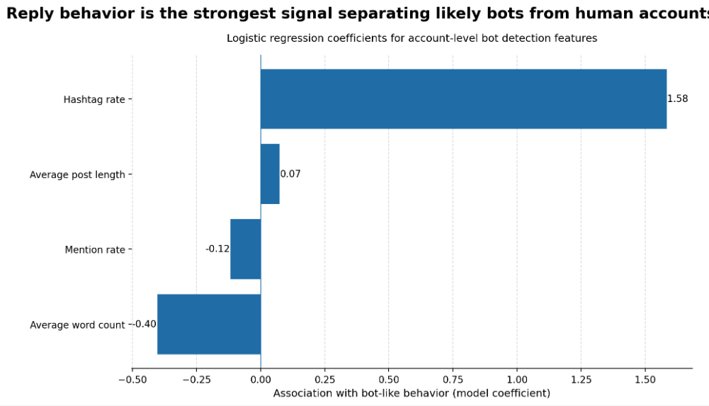

# New Tool Uses Real-Time Data to Identify Bot-Like Activity on Social Media Platforms

## Curious about how many bots are cluttering your platform? This tool can help identify which users exhibit bot-like behavior. 

## Problem Statement 
Automated accounts on social media, or “bots,” are a real issue for platforms. They show up as spam, promotional content, or just noise that makes the user experience worse. They also mess with engagement metrics by inflating activity, which makes it harder to understand what real users are actually doing. On top of that, a large amount of automated traffic can put unnecessary load on platform infrastructure.

The bigger problem is that bots are not always easy to identify. Some behave very similarly to real users, and there is usually no clear ground truth to label accounts as bot or human. This makes it difficult to build reliable detection systems.

This project focuses on developing a model to identify accounts on Bluesky that are likely automated using engagement patterns, posting behavior, and text features. The Bluesky implementation acts as a proof of concept, showing how real-time data can be used to detect bot-like behavior in practice. The goal is that this approach could be applied to other platforms to estimate how much of their activity comes from bots and better understand the overall health of their ecosystem.

## Solution Description 

This project builds a simple, data-driven way to identify accounts that behave like bots on a social media platform. Instead of trying to look at everything an account does in detail, the approach focuses on a few key patterns that are easy to observe: how often an account posts, whether it tends to reply to others, and what kinds of content it includes (such as links, hashtags, or mentions).

The idea is that bots tend to behave differently than real users in consistent ways. For example, they might post very frequently, include a lot of links, or act more like they are broadcasting content rather than having conversations. By turning these behaviors into measurable features, the model can start to pick up on patterns that are associated with automated activity.

The system then looks at these features at the account level and uses them to estimate whether an account is more likely to be bot-like or human-like. Importantly, this is not meant to be a perfect or definitive classification. Instead, it’s designed to flag accounts that match a certain behavioral profile, especially those that stand out as extreme or unusual compared to typical users.

The model performed well overall, achieving an accuracy of **83%**, which suggests that these relatively simple behavioral features are effective for identifying bot-like accounts. The results also show that not all features contribute equally. As shown in the chart below, certain behaviors have a much stronger relationship with bot-like activity than others.

In particular, hashtag usage emerges as the strongest positive signal, meaning accounts that frequently use hashtags are much more likely to be classified as bot-like. On the other hand, features like higher word count and mention rate are associated with more human-like behavior, likely because they reflect more conversational or engaged posting patterns. These results reinforce the idea that bots tend to broadcast content, while real users are more likely to interact.

One of the key goals of this approach is to keep it interpretable and practical. Rather than relying on complex or opaque methods, the model uses features that are easy to understand and explain. This makes it easier for platforms to not only detect bot-like accounts, but also understand why those accounts are being flagged.

Overall, this solution shows that even with relatively simple signals and real-time data, it is possible to get a meaningful estimate of bot activity on a platform. It provides a starting point for measuring how much of a platform’s activity may be automated, and could be extended or refined for use in larger-scale moderation or analytics systems.

## Chart

*Figure: Model coefficients showing which features are most associated with bot-like behavior. Hashtag usage has the strongest positive relationship, while higher word count and mention rate are more associated with human-like accounts.*